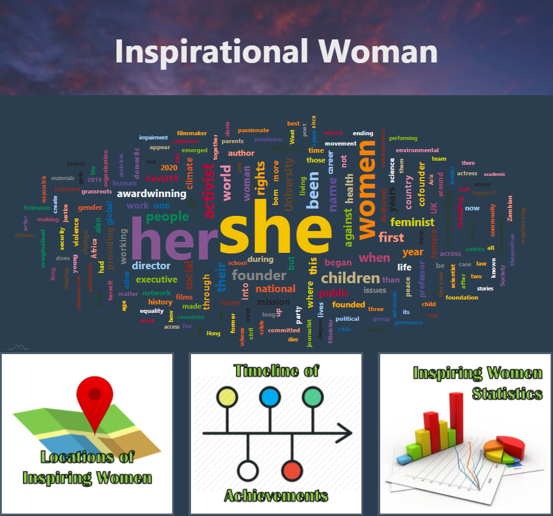
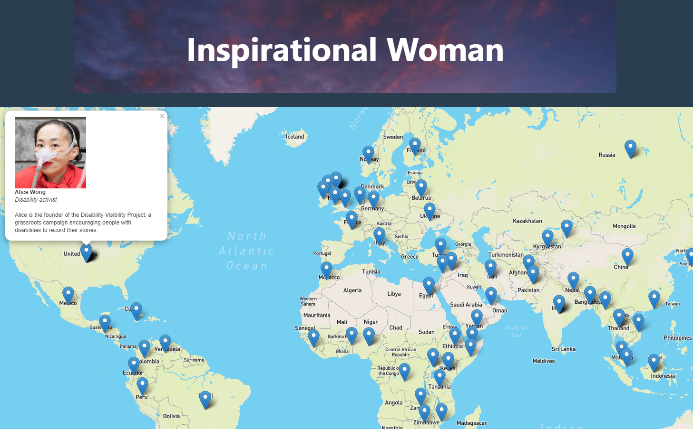

# Inspiring Women Data Analysis Project
The purpose of this project is to create a dynamic, user-interactive dashboard showcasing inspiring women from around the world through the means of the world map, graphs, and other visually pleasing tools.

### Dataset Sources:
* https://github.com/rfordatascience/tidytuesday/tree/master/data/2020/2020-12-08
* https://www.worldathletics.org/records/by-category/world-records

---

## Project Description
**Step 1: Web Scraping and Cleaning Data**
- Using tools such as `Beautiful Soup` and `Jupyter Notebook` to scrape and organize datas from [World Athletics](https://www.worldathletics.org/records/by-category/world-records) and [Woman CSV Data](https://github.com/rfordatascience/tidytuesday/tree/master/data/2020/2020-12-08).
- Store the data to local `MongoDB` server.

**Step 2: HTML/CSS/JS**
- Develop `index.html` as main page that will connect to various visualizations like maps, plots, and timeline.
- Main page utilizes `amcharts` wordcloud that displays most commonly found words in inspiring women descriptions.

**Step 3: Flask Application**
- Connect the created html pages to `app.py`.
- `Flask-Pymongo` library is required.

---

## Sample Screenshots
**Main Page**

**Maps Page**

---

## Getting Started
1. Clone this repo.
2. Create a [Mapbox Token](https://account.mapbox.com/auth/signup/).
3. Include your `Mapbox Token` in the `/templates/static/js/config.js` file.
4. Run `flask run` or `python -m http.server` or any other method for this purpose.
